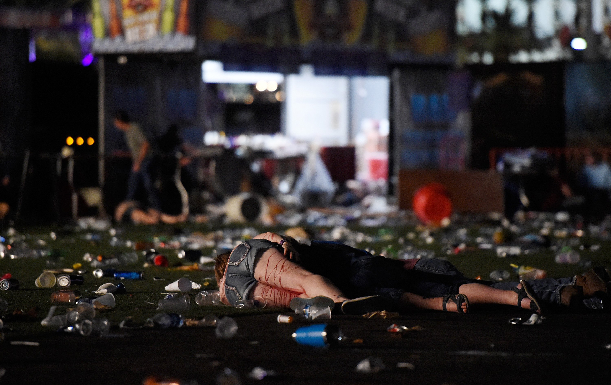

---

```{r, echo = FALSE, message = FALSE}
# Set time zone
Sys.setenv(TZ="Europe/Berlin")

# Load libraries
library(dplyr)
library(ggplot2)
library(knitr)
library(leaflet)
library(plotly)
library(rlang)

# Source file
source('./analysis.R')

# Specify data file
file <- './data/shooting-data.csv'
top.states.num <- 5
data <- read.csv(file, stringsAsFactors = FALSE)
info <- FetchInfoPkg(data, top.states.num)
```

## Overview

Gun control has been debated for decades. As more shooting incidents 
occurred recent years, voices calling for the government to enact new 
gun regulations to restrict citizens' purchasing of weapons are 
increasing. As in 2017, `r info$total.killed` people were killed and 
`r info$total.injured` people got injured in shooting incidents. Below 
is a reactive map on which all shooting incidents occurred in 2017 are 
marked.

```{r, echo = FALSE, message = FALSE}
# Fetch shooting map
FetchMap(data)
```

**Note:**<br>
Each circle on the above map represents a collection of incidents. The 
larger the collection is, the closer the circle color is to orange, 
farther to green. Click the circle and the incidents separate. Each 
pushpin represents an incident. Notice that pushpins have different 
colors. If we regard each injury as one tenth death, then we can 
calculate the "magnitude" of each incident. If the magnitude is small, 
the pushpin color is green. Medium, orange.
Serious, Red(e.g., Las Vegas mass shooting). Click the cross mark on a 
pushpin, a window will pop up showing the date, city, state, injured 
people and killed people of the incident.

## Shootings By State

First, let's have a look at the state casualty ranking.

`r kable(info$casualty.df)`

*Formula:*<br>
casualty = killed + injured

**Note:**<br>
The above table shows each state's casualties in shooting incidents in descending order.

From the table, we know that `r info$top.states` are the states where 
more than 100 people got killed or injured in shootings. After seeing 
the ranking table, what about the percentages of each state? Below is a 
pie chart showing the percentages of the top `r top.states.num` states 
and that of all other states combined.

```{r, echo = FALSE, message = FALSE}
FetchPiechart(data, top.states.num)
```

Using numbers to compare shootings among states may seem abstract for 
the viewers. However, with a pie chart, it is clear which states have 
the most casualties and what percentages they make up of the entire 
nation.

Specifically, it is really easy to see that the shooting casualties of 
the top `r length(info$top.states) - 1` states(
`r info$top.states[1:top.states.num]`) make up `r info$top.pct`% of 
that of the entire nation. Also, the casualties of the first state, 
`r info$top.states[[1]]` is about `r info$st.nd.times` times that of 
the second state, `r info$top.states[[2]]`.

If we dig into the pie chart above, we may find a "correlation" 
between the strict-ness of a state's gun regulations and the 
casualties it got in shooting incidents. From the chart above, we 
know that `r info$top.states[[1]]` has the most casualties of 
`r info$casualty.df$casualty[1]` people. It is known that 
`r info$top.states[[1]]` has some of the most relaxed gun laws in 
the US. Gun laws in `r info$top.states[[1]]` can be found 
[here](https://www.wikiwand.com/en/Gun_laws_in_Nevada).

In contrast, `r info$leat.casulty.state$state` are states where least 
people were killed in shootings. Also, these are states with the 
strictest gun regulations.

*In this sense, there seems to be a correlation between the 
strict-ness of a state’s gun law and the casulaty rate in that state.
* **Generally, the stricter the gun law, the lower the casualty rate.**

## Shootings By Month

Let's have a look at the casualties by each month. We want to see 
which month has the most casualties and why.

```{r, echo = FALSE, message = FALSE}
FetchBarplot(data)
```
From the above bar plot, it is clear that 
`r info$most.death.month$month` is the month where most people lost 
their lives(`r info$most.death.month$killed` lives). And it is due to 
the **mass shooting** occurred in `r info$most.death.city$city`.

## Mass Shooting Incident



On `r info$mass.shooting.date`, the **deadliest** mass shooting was 
committed by *an individual* in the United States. That night, gunman 
Stephen Paddock opened fire on a crowd of concertgoers at music 
festival on the `r info$most.death.city$city` Strip in 
`r info$top.states[[1]]` In this incident, 
`r info$most.death.city$killed` people lost their life. 
An additional `r info$most.death.city$injured` people were injured. In 
the aftermath, many victims were sent to area hospitals. More 
information can be found on [Wikipedia](https://www.wikiwand.com/en/2017_Las_Vegas_shooting#/Aftermath_and_reactions), 
[BBC News](http://www.bbc.com/news/world-us-canada-41471242) and 
[New York Times](https://www.nytimes.com/2017/10/02/us/las-vegas-shooting.html).